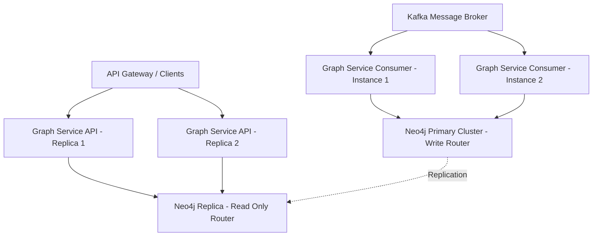

# Graph Service Deployment & Production Hardening Guide

This document outlines deployment configurations, resource recommendations, scaling strategies, and database optimization techniques for running Graph Service in a high-availability production environment.

---

## 1. Production Architecture Summary



Graph Service runs in two distinct roles which can be scaled independently:
1. **API Traversal Server (Read-heavy)**: Serves client REST requests and traverses paths on Neo4j read replicas.
2. **Kafka Consumer Worker (Write-heavy)**: Synchronizes conversation lifecycle events and updates the Neo4j primary database cluster.

---

## 2. Horizontal Scaling & Partition Partitioning

### Kafka Topic Configs
To handle high concurrent loads, Kafka topics must be configured with multiple partitions (e.g. 3 or more partitions based on the expected write volume).

```bash
# Recommended topic creation parameters
kafka-topics.sh --create --bootstrap-server <broker-ips> \
  --topic conversation.created --partitions 6 --replication-factor 3
  
kafka-topics.sh --create --bootstrap-server <broker-ips> \
  --topic conversation.updated --partitions 6 --replication-factor 3
  
kafka-topics.sh --create --bootstrap-server <broker-ips> \
  --topic conversation.deleted --partitions 6 --replication-factor 3
```

### Consumer Group Concurrency
To scale event ingestion, run multiple instances of the Graph Service worker sharing the same `KAFKA_CONSUMER_GROUP_ID` (default: `graph-service-consumer`). 
- **Rule**: Number of active consumer instances should not exceed the partition count of the topics (e.g., if there are 6 partitions, you can run up to 6 concurrent consumer worker instances).
- **At-least-once Guarantee**: Ensure `enable_auto_commit` remains `False`. The worker commits offsets only after successful Neo4j writes.

---

## 3. Database Tuning & Transaction Routing

### read-replica Routing
All traversal APIs in Graph Service use `session.execute_read()` transaction functions.
- In a clustered Neo4j configuration (Neo4j Causal Clustering), read transaction commands are automatically routed to secondary/read-only nodes.
- Primary write transactions are executed using `session.execute_write()` to guarantee consistency.

### Driver & Connection Pool Settings
Adjust Neo4j Driver parameters in production to handle high connection concurrency:
- **Max Connection Pool Size**: Increase `max_connection_pool_size` (default: 100 connections per host) in `Neo4jDatabase` configuration if dealing with heavy concurrent API traffic.
- **Connection Acquisition Timeout**: Adjust `connection_acquisition_timeout` to define how long an API worker waits for a database connection before failing gracefully.

### Neo4j Index Optimizations
To speed up query matching, the application auto-applies uniqueness constraints and indexes on startup:
1. **Uniqueness Constraint**: `FOR (c:Conversation) REQUIRE c.conversation_id IS UNIQUE` (optimizes node lookups).
2. **Index**: `FOR (c:Conversation) ON (c.user_id)` (optimizes user-level lookups).

---

## 4. Production Environment Configuration Tuning

Recommended production `.env` setup:

```env
# Server
APP_HOST=0.0.0.0
APP_PORT=8000
PROJECT_NAME="Granthan Graph Service"

# Neo4j Clustered URI
NEO4J_URI=neo4j+s://primary.neo4j.prod.internal:7687
NEO4J_USER=graph_app_user
NEO4J_PASSWORD=SecurePasswordProd123!

# Kafka High Availability Brokers
KAFKA_BOOTSTRAP_SERVERS=kafka-broker1:9092,kafka-broker2:9092,kafka-broker3:9092
KAFKA_CONSUMER_GROUP_ID=graph-service-prod-group

# Batching Optimization
KAFKA_BATCH_SIZE=250
KAFKA_BATCH_TIMEOUT_MS=500

# Consistency Toggles
SOFT_DELETE_ENABLED=true
```

### Batch Ingestion Metrics
- **`KAFKA_BATCH_SIZE`**: Sets the maximum number of events fetched in a single consumer pull. Increasing this value reduces Kafka commit overhead and improves throughput.
- **`KAFKA_BATCH_TIMEOUT_MS`**: Time limits for consumer waiting before processing a smaller batch. Lower values (e.g., 500ms) decrease latency, while higher values improve batching efficiency.
